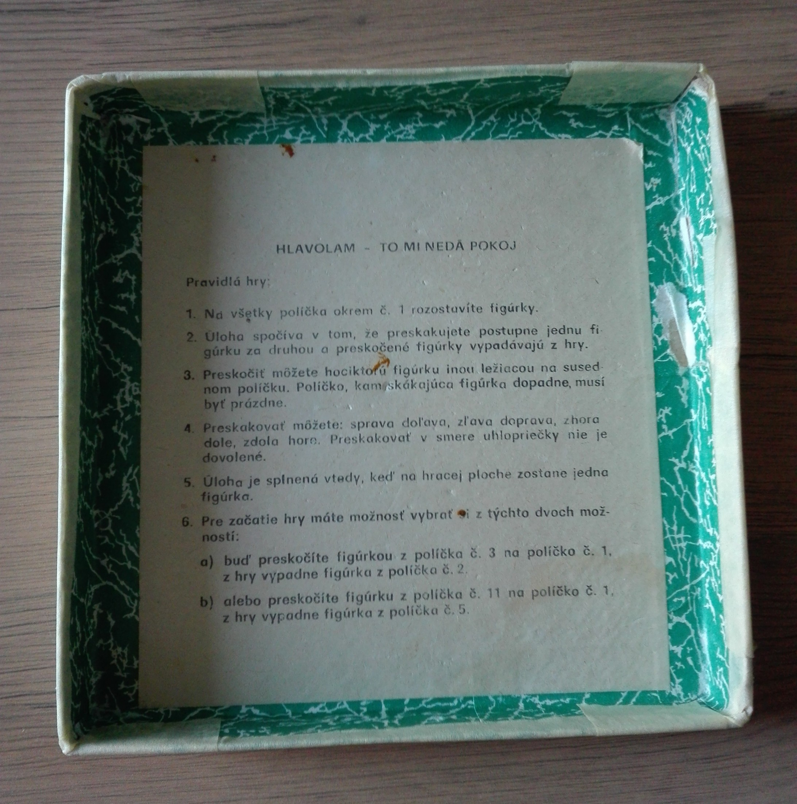
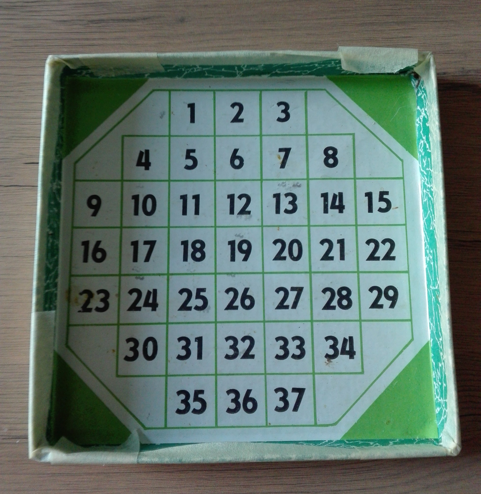
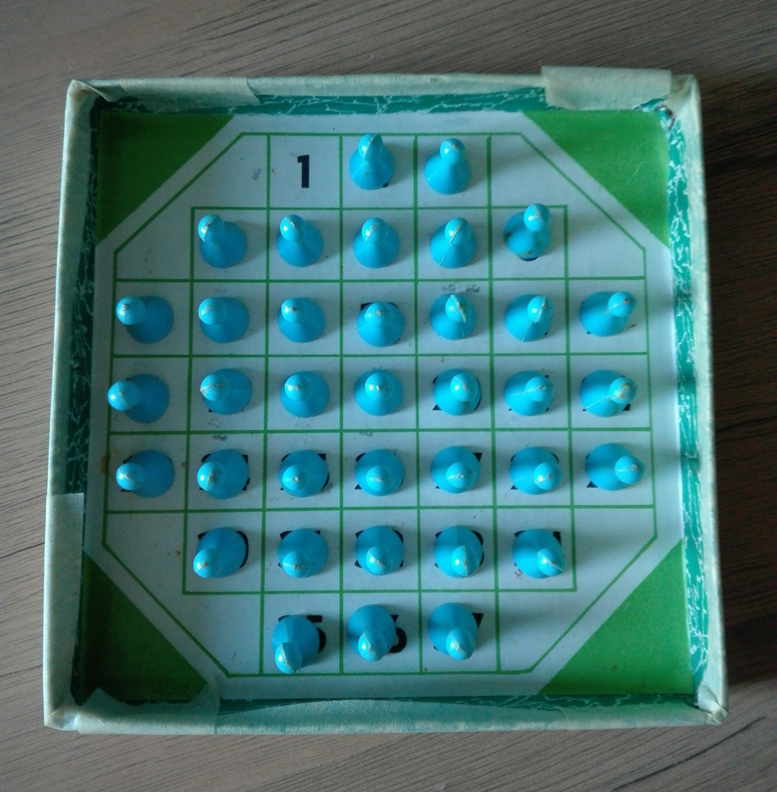

# Dokumentace FLP II. projekt
Autor: xmikul69

Vysoké učení technické v Brně

2022/2023

Vlastní zadání: "To mi nedá pokoj"

# Zadání

Zadání projektu vychází z pravidel hry, uvedených v náskledující kapitole. Od uvedených pravidel je zadání rozšířeno o možnost zvolit počáteční pozici.

Vstupem je 37 jedniček a nul libovolně oddělených bílými znaky, které kódují počáteční pozici - znak 1 označuje obsazené pole, znak 0 neobsazené. Ve vstupu se mohou vyskytovat komentáře začínající znakem %.

##  Hra "To mi nedá pokoj"

(zdroj obrázků: vlastní)

### Pravidla:


### Hrací pole:


### Počáteční pozice:



# Překlad a spuštění

Projekt je vypracován v jazyce Prolog a byl otestován s verzí SWI Prolog 9.0.4 a 6.6.1. Pro překlad je
přiložen Makefile. Cíl flp22-log zkompiluje optimalizovanou verzi, cíl flp22-log-naive naivní verzi. Ve
složce tests se nachází vstupní soubory, pojmenované dle obtížnosti počáteční pozice.

Obě implementace mají stejné uživatelské rozhraní. Po nalezení řešení program vypíše kroky k němu vedoucí a stav hracího pole mezi jednotlivými tahy.

# Popis použité metody řešenı́

## Naivní implementace

Stav hracího pole je kódován lineárním polem o 37 prvcích, kde každý odpovídá poli dle obrázku "hrací pole" výše. Dvourozměrné kódování nepřináší výhodu jednoduchosti popisu ani rychlosti výpočtu. Program je rozdělen do částí, které definují hrací pole, herní logiku (možné tahy), formátovaný výpis uživateli, načtení dat a hlavní část, která obsahuje vstupní predikát programu a predikát solve, který tvoří rekurzivní zanořování při hledání cesty k výherní pozici.

## Optimalizovaná implementace

Optimalizovaná verze vychází z naivní, do které byly přidány následující optimalizace:

- explicitněji definovaná relace sousednosti polí hrací plochy,
- přeuspořádání částí predikátu possible_move,
- dynamicky vytvářený seznam pozic, které byly prozkoumány a nemají řešení,
    - tento seznam je navíc ukládán spolu s počtem zbývajících figur, čímž je zrychleno vyhledávání.
- ověřování, zda je pozice výherní, dle počtu zanoření. Jelikož počet tahů vedoucích k výhře musí být roven počtu figur na začátku - 1, lze toho využít namísto procházení pole a hledání dvou a více figur.


Optimalizace dle experimentů na přiložených testech způsobují mnohonásobné zrychlení.

# Spuštění s vlastnı́mi vstupy

Připravené vstupní soubory je možno předat pomocí pipe, např.:
```
./flp22-log < tests/medium1.test
```

V souborech s testovacími vstupy je napsáno, jak dlouho jejich řešení trvá pro naivní i optimalizovanou verzi na referenčním serveru merlin.fit.vut.cz.


# Postskriptum - po odevzdání

Obě implementované verze jsou příliš pomalé, než aby dokázaly nalézt řešení z počáteční pozice. Po odevzdání projektu autor nalezl tzv. Peg solitaire, jehož evropská verze je shodná s pravidly implementované hry.

Jedno z možných řešení je [zde](https://en.wikipedia.org/wiki/Peg_solitaire#Solutions_to_the_European_game) (v jiném souřadnicovém systému, než používá tento projekt).


## Další informace:
- https://www.zatrolene-hry.cz/spolecenska-hra/to-mi-neda-pokoj-8518/
- https://en.wikipedia.org/wiki/Peg_solitaire
  - https://en.wikipedia.org/wiki/Peg_solitaire#Solutions_to_the_European_game
- https://www.reddit.com/r/compsci/comments/zgrx84/how_would_you_write_an_algorithm_to_solve_this/
- http://www.deskovehry.info/pravidla/soliter.htm
